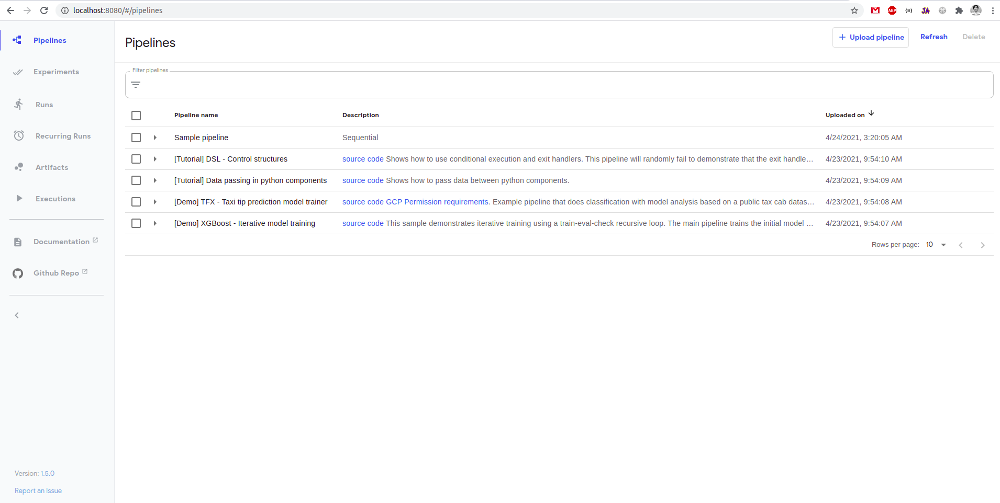

# kubeflow-kinD

This is a simple repository to install kubeflow pipeline in local kinD cluster.

##### What is kinD?
kinD is a tool to run kubernetes cluster in docker container in local machine. Documentation can be found [here](https://kind.sigs.k8s.io/).

##### What is kubeflow?
The Kubeflow project is dedicated to making deployments of machine learning (ML) workflows on Kubernetes simple, portable and scalable. Details can be found [here](https://www.kubeflow.org/).

### Install kinD
kinD installation guide can be found [here](https://kind.sigs.k8s.io/docs/user/quick-start/#installation).

On linux
    
    export KIND_DIR=/<some-dir>
    curl -Lo ./kind https://kind.sigs.k8s.io/dl/v0.10.0/kind-linux-amd64
    chmod +x ./kind
    mv ./kind $KIND_DIR/kind
    
    # export to $PATH
    export PATH="$KIND_DIR/:$PATH"

### Create k8s cluster in kinD
    
    # create k8s cluster
    kind create cluster --name kf-pipeline
    
    # get cluster list
    kind get clusters
    
### Deploy kubeflow pipeline in local k8s cluster

    # env/platform-agnostic-pns hasn't been publically released, so you will install it from master
    export PIPELINE_VERSION=1.5.0
    kubectl apply -k "github.com/kubeflow/pipelines/manifests/kustomize/cluster-scoped-resources?ref=$PIPELINE_VERSION"
    kubectl wait --for condition=established --timeout=300s crd/applications.app.k8s.io
    kubectl apply -k "github.com/kubeflow/pipelines/manifests/kustomize/env/platform-agnostic-pns?ref=$PIPELINE_VERSION" --timeout=60s
    
    # pods are created under kuebflow namespace, get the list of pods
    kubectl get po -n kubeflow -o wide
    
##### kubeflow pipeline UI

    kubectl port-forward -n kubeflow svc/ml-pipeline-ui 8080:80

Pipeline ui can be accessible at `http://localhost:8080`    

### Uninstall kubeflow pipeline

    export PIPELINE_VERSION=1.5.0
    kubectl delete -k "github.com/kubeflow/pipelines/manifests/kustomize/env/platform-agnostic-pns?ref=$PIPELINE_VERSION"
    kubectl delete -k "github.com/kubeflow/pipelines/manifests/kustomize/cluster-scoped-resources?ref=$PIPELINE_VERSION"

#### Reference
*   [kubeflow docs](https://www.kubeflow.org/docs/)
*   [kinD docs](https://kind.sigs.k8s.io/docs/user/quick-start/)
*   [Deploy kf pipeline in kinD](https://www.kubeflow.org/docs/components/pipelines/installation/localcluster-deployment/)

